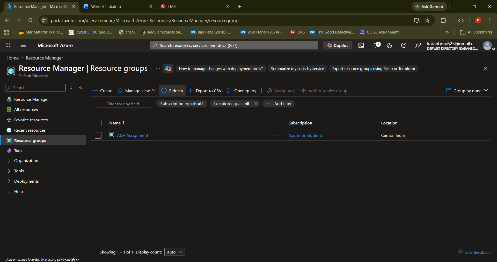
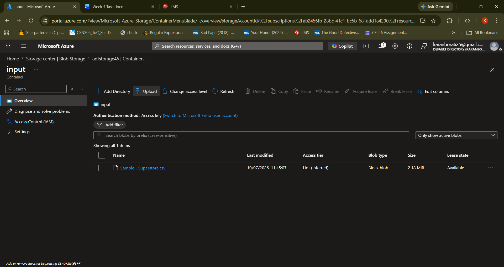
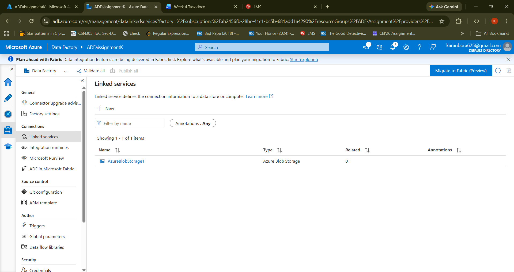
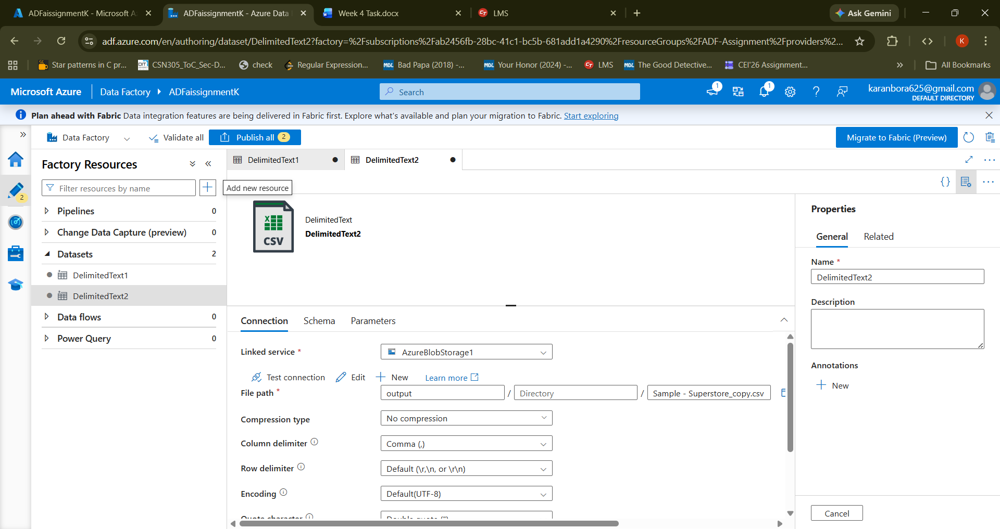
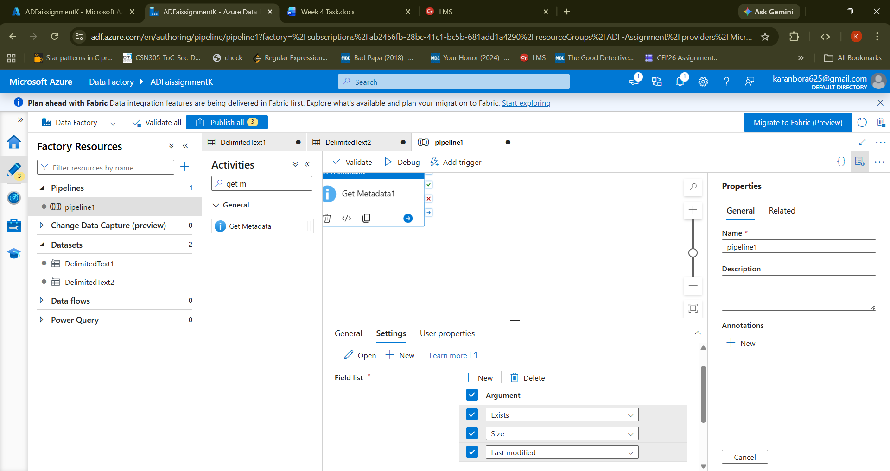
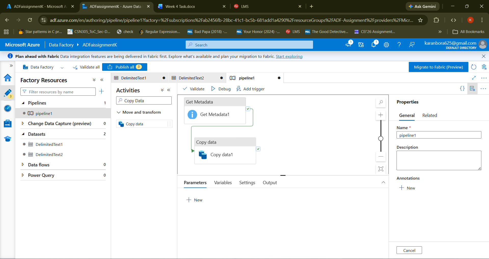
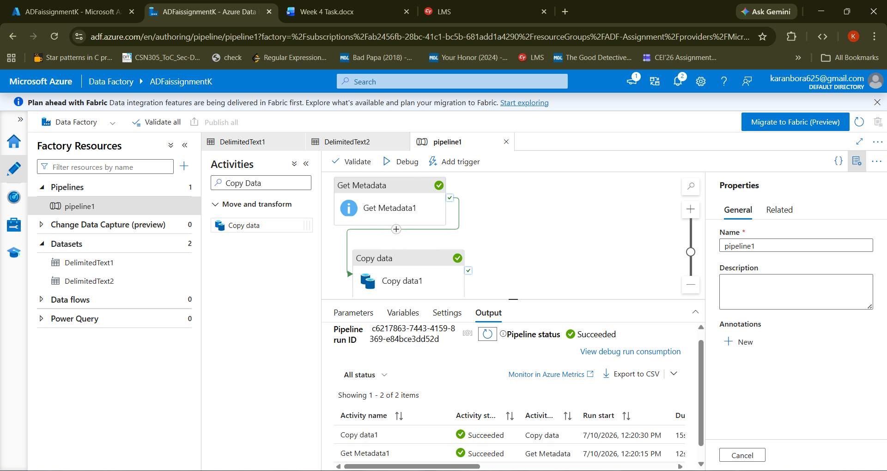
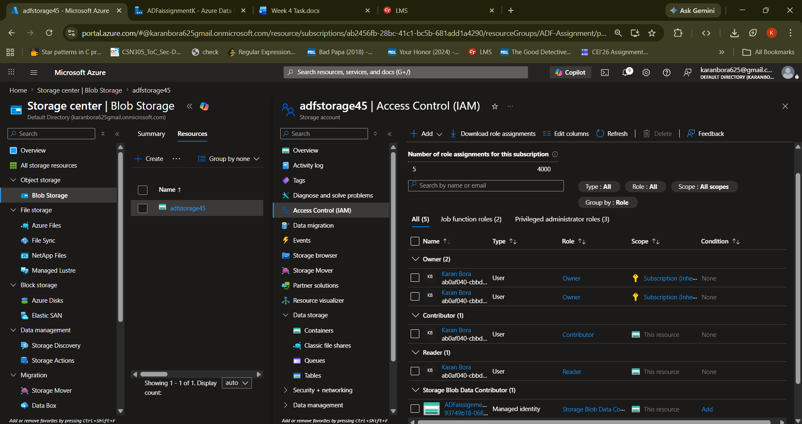

# Azure Cloud Fundamentals and Data Pipeline Implementation using Azure Data Factory

## Project Overview

This project demonstrates the implementation of a complete data pipeline using **Microsoft Azure**. The pipeline reads a CSV file from Azure Blob Storage, validates its metadata using Azure Data Factory, and copies the file to another Blob Storage location. The project also includes Azure Identity and Access Management (IAM) role assignments for secure resource access.

---

## Objective

- Understand Azure cloud fundamentals.
- Create and manage Azure resources.
- Store data using Azure Blob Storage.
- Build and execute a data pipeline using Azure Data Factory.
- Validate file metadata before processing.
- Configure IAM roles for secure access.

---

## Azure Services Used

| Azure Service | Purpose |
|---------------|---------|
| Azure Resource Group | Organizes and manages Azure resources |
| Azure Storage Account | Stores data in Azure |
| Azure Blob Storage | Stores source and destination CSV files |
| Azure Data Factory (ADF) | Builds and executes the data pipeline |
| Azure IAM | Manages permissions and access control |

---

## Project Architecture

```
                Azure Resource Group
                        │
        ┌───────────────┴───────────────┐
        │                               │
 Azure Storage Account          Azure Data Factory
        │                               │
        │                      Linked Service
        │                               │
        ▼                               ▼
 Input Blob Container          Source Dataset
 (Sample-Superstore.csv)              │
                                      ▼
                               Get Metadata
                                      │
                                      ▼
                                 Copy Data
                                      │
                                      ▼
                             Destination Dataset
                                      │
                                      ▼
                        Output Blob Container
```

---

## Assignment Tasks

### Task 1 – Resource Group

- Created an Azure Resource Group to organize all Azure resources.

**Screenshot**



---

### Task 2 – Storage Setup

Completed the following tasks:

- Created an Azure Storage Account.
- Created Blob Containers:
  - `input`
  - `output`
- Uploaded the CSV file to the **input** container.

**Screenshot**



---

### Task 3 – Azure Data Factory

Configured Azure Data Factory by creating:

- Linked Service for Azure Blob Storage
- Source Dataset
- Destination Dataset
- Get Metadata Activity

#### Linked Service



#### Dataset



#### Get Metadata Activity

Metadata fields validated:

- Exists
- Size
- Last Modified



---

### Task 4 – Pipeline Development

Developed a pipeline consisting of:

- Get Metadata Activity
- Copy Data Activity

Pipeline Flow:

```
Source CSV
     │
     ▼
Get Metadata
     │
     ▼
Copy Data
     │
     ▼
Destination CSV
```

**Screenshot**



---

### Task 5 – Pipeline Execution

The pipeline was executed successfully using **Debug**.

**Result**

- Metadata validated successfully.
- CSV copied successfully.
- Pipeline execution completed with **Succeeded** status.

**Screenshot**



---

### Task 6 – IAM Role Assignment

Configured the following Azure roles:

- Reader
- Contributor
- Storage Blob Data Contributor (Azure Data Factory Managed Identity)

**Screenshot**



---

## Project Workflow

```
Azure Blob Storage (Input)
            │
            ▼
      Azure Data Factory
            │
            ▼
      Get Metadata Activity
            │
            ▼
      Copy Data Activity
            │
            ▼
Azure Blob Storage (Output)
```

---

## Input

- File Format: CSV
- Source Container: `input`

---

## Output

- Metadata validated successfully.
- CSV copied to the destination Blob container.
- Pipeline executed successfully.

---

## Repository Structure

```
Azure-Cloud-Fundamentals-ADF/
│
├── README.md
├── screenshots/
│   ├── 01-resource-group.png
│   ├── 02-blob-container.png
│   ├── 03-linked-service.png
│   ├── 04-dataset.png
│   ├── 05-get-metadata.png
│   ├── 06-pipeline-design.png
│   ├── 07-pipeline-success.png
│   └── 08-iam-roles.png
│
└── sample-data/
    └── Sample-Superstore.csv
```

---

## Conclusion

This project successfully demonstrates the implementation of a complete Azure Data Factory pipeline using Azure Blob Storage. It covers the creation of Azure resources, data ingestion, metadata validation, data movement, pipeline execution, and IAM role configuration, providing a practical introduction to Azure cloud services and data engineering workflows.

